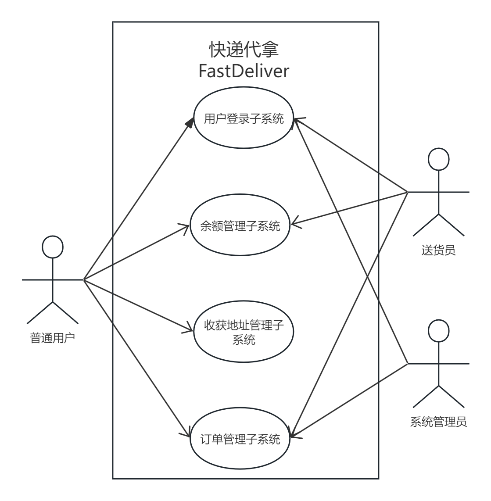
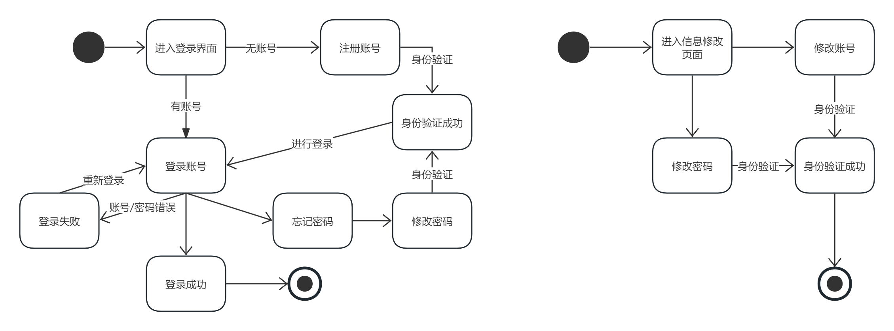

## 1 引言

### 1.1 编写目的

本软件需求说明书的目的是明确详细地描述“快递代拿（FastDeliver）”项目的总体业务需求和功能需求。文档的目标读者为项目的全体成员。

帮助读者正确且全面地了解该软件系统要达成的业务目标,必须支持的主要功能,以及非功能性需求。这有助于在后续的设计、编码和测试阶段满足用户的实际需求。同时也有助于各相关方对整个项目有一个共同的认知。本文档附带的用例描述、数据流图等模型与描述同样对于帮助相关方理解该系统的业务流程与功能具有重要意义。

### 1.2 背景

A. 项目名称是“快递代拿”(FastDeliver)

B. 本项目的任务提出者为软件工程课程快递代拿小组,开发者为该小组中的全部同学,用户为集美大学的在校学生。主要功能是实现用户登录，用户订单，送货员接受订单和订单跟踪，售后订单管理等功能。项目周期为2周。

C. 该软件系统需要与以下系统进行数据交互（TODO）:

* 第三方支付系统:实现学生订单在线支付功能
* 地图导航系统:优化快递

### 1.3 定义（TODO）

### 1.4 参考资料（TODO）

## 2 任务概述

### 2.1 目标

#### 2.1.1市场目标

项目的市场目标是满足集美大学在校学生对于快递代拿服务的需求，以提供更加便捷、高效的生活方式。通过在校园内推广和提供可靠的快递代拿服务，我们旨在建立并巩固在集美大学校园内的用户群体，成为学生们日常生活中不可或缺的服务平台。市场目标的实现将通过以下方面来衡量：

1. **用户覆盖率提升：** 在项目启动后，我们将追求在集美大学校园内获得更高的用户覆盖率，吸引更多学生成为我们的快递代拿服务用户。

2. **用户满意度：** 通过用户反馈、评价和调查，我们将关注并不断提高用户满意度，确保用户对我们的服务感到满意，形成口碑传播。

3. **市场份额增长：** 我们的目标是逐步扩大在集美大学校园内的市场份额，成为该领域的领先服务提供商。

#### 2.1.2 技术目标

客户端-普通用户：用户能够正常注册、登录，容易理解软件逻辑，进行充值操作，并成功提交订单。

客户端-送货员：送货员能够正常注册、登录，能够正常的接受订单，更新订单状态，并成功完成订单，能够对余额进行提现。

后台管理系统：希望能够查看所有订单，并对订单进行跟踪，并处理来自用户、送货 员的售后请求。

### 2.2 用户的特点

#### 2.2.1 客户端-普通用户

1. **地理需求:** 主要集中在宿舍距离快递驿站较远的学生群体，他们更容易感受到取快递的不便之处。
2. **支付意愿:** 具有一定经济实力，意支付一定金额来换取他人代取快递的服务。
3. **时间紧迫:** 有对时间的迫切需求，可能是因为学业繁忙或其他活动，因此寻求更为高效的快递取送方式。
4. **用户年龄:** 在校学生，年龄涵盖大学的各个年级。

#### 2.2.2 客户端-送货员

1. **时间灵活:** 具有较多空闲时间，愿意兼职，可以配合用户的下单需求进行取送快递。
2. **学生身份:** 在校学生，因此了解各快递驿站和宿舍位置，并且对于学生的生活、需求较为理解，便于与普通用户建立更好的沟通和信任关系。
3. **希望兼职:** 寻求额外的收入来源，愿意通过服务他人来实现自己的兼职目标。
4. **服务态度:** 具备良好的服务态度，理解用户需求，能够保持友好、高效的服务。

#### 2.2.3 后台管理系统

1. **计算机熟练操作者:** 熟悉计算机操作，能够迅速适应和理解管理系统的用户界面。

2. **沟通技巧:** 具备良好的沟通技能，能够清晰表达问题、需求和建议。这对于与其他系统用户、技术支持团队和系统管理员的协作至关重要。

3. **用户服务导向:** 注重用户体验，能够理解和关注用户需求，以提供更好的服务。对用户提出的请求和问题做出及时响应。

### 2.3 假定和约束（TODO）

经费限制：云服务器租用费用；

开发期限：2周；

硬件限制：客户端与后台管理系统通过浏览器以网站的形式访问；

运行环境：服务端运行于ubuntu linux操作系统；

## 3 需求规定

### 3.1 对功能的规定

#### 3.1.1 系统功能组成

快递代拿（FastDeliver）服务系统包含以下子系统：

1. 用户登录子系统：包含用户的登录、注册、忘记密码、更改登录信息等功能；

2. 收获地址管理子系统：包含添加收获地址、删除收获地址、修改收获地址等功能；

3. 余额管理子系统：包含余额查询、交易记录查询、充值等功能；

4. 订单管理子系统：包含与普通用户有关的提交订单、取消订单、订单查询、订单状态查看等功能，与送货员相关的接受订单、订单状态更新、订单查询等功能，与后台管理员相关的订单跟踪、订单审核等功能；

#### 3.1.2 功能描述

##### 3.1.2.1 用户管理子系统

1. 用户范围

普通用户、快递员、系统管理员

2. 功能
- 注册

- 登录

- 修改密码

- 修改账号信息
3. 用例模式图

4. 状态图

##### 3.1.2.2 收货地址管理子系统

1. 用户范围

普通用户

2. 功能
- 添加收获地址

- 删除收获地址

- 修改收获地址
3. 用例模式图

4. 状态图

##### 3.1.2.3 余额管理子系统（TODO）

1. 用户范围

普通用户、送货员

2. 余额查询
- 余额查询

- 交易记录查询

- 充值等功能
3. 用例图
   
   

4. 状态图
   
   
   
   
   
   

##### 3.1.2.4 订单管理子系统（TODO）

1. 用户范围

普通用户、送货员、系统管理员

2. 功能
- 普通用户
  
  - 提交订单
  
  - 取消订单
  
  - 历史订单
  
  - 订单详情

- 送货员
  
  - 接受订单
  
  - 订单状态更新
  
  - 历史订单
  
  - 订单详情

- 系统管理员
  
  - 订单列表
  
  - 订单详情
  
  - 订单审核
3. 用例图
   
   

4. 状态图

#### 3.1.3 数据需求

##### 3.1.3.1 静态数据

1. 使用数据库存储用户、地址、订单、金额等各项信息；

2. 建立专门的资源文件夹存储UI界面用到的图片、字体等素材；

3. 使用阿里云oss对象存储存储系统运行过程中由用户产生的图片。

##### 3.1.3.2 动态数据

用户注册登录时提供的账户与密码；

用户修改账号信息，如手机号、邮箱、密码；

用户进入主界面时系统自动获取当前时间信息；

普通用户提交订单时的订单信息；

普通用户提交订单时系统生成的订单号、下单时间、订单状态、余额变动等信息；

普通用户取消订单时系统生成的退款时间与退款订单状态信息；

普通用户确认收获时产生的订单状态信息；

普通用户在充值时产生的余额变动信息、交易记录信息；

送货员在接受订单时由系统生成的接单时间等信息；

送货员在订单状态更新时的订单状态、对应状态的时间信息；

送货员在提现时生成的余额变动信息，交易记录信息；

后台管理员在对完成订单审核时产生的送货员的余额变动信息；

##### 3.1.3.3 数据字典

用户管理

| 数据名 | 数据类型    | 说明              |
| --- | ------- | --------------- |
| 账号  | INT     | 由系统生成，作为用户的唯一标识 |
| 昵称  | VARCHAR | 由用户自定义          |
| 密码  | VARCHAR | 账号验证的依据         |
| 手机号 | VARCHAR | 作为用户身份验证的依据     |

余额表

| 数据名      | 数据类型    | 说明                                          |
| -------- | ------- | ------------------------------------------- |
| 账号       | VARCHAR | 作为外键与用户表关联，标识该条记录的归属                        |
| 总金额      | INT     | 可提现/支付余额和冻结金额总和                             |
| 可提现/支付金额 | INT     |                                             |
| 冻结金额     | INT     | 用户提交订单后冻结订单相应金额/送货员完成订单后后台管理员订单审核前冻结的订单相应金额 |

交易记录表

| 数据名  | 数据类型 | 说明                    |
| ---- | ---- | --------------------- |
| 交易单号 | INT  | 由系统生成，作为交易记录的唯一标识     |
| 账号   | INT  | 作为外键与用户表关联，该条交易记录的归属方 |
| 交易时间 | DATE |                       |
| 交易金额 | DATE |                       |

订单表

| 数据名           | 数据类型    | 说明                                               |
| ------------- | ------- | ------------------------------------------------ |
| 订单号           | INT     | 由系统生成，作为订单的唯一标识                                  |
| 用户账号          | INT     | 标识该订单的下单方                                        |
| 送货员账号         | INT     | 标识该订单的送货员方                                       |
| 后台管理员账号       | INT     | 标识该订单的审核方                                        |
| 收获地址          | VARCHAR |                                                  |
| 收获人姓名         | VARCHAR |                                                  |
| 收货人电话         | VARCHAR |                                                  |
| 快递驿站位置        | VARCHAR |                                                  |
| 取件码           | VARCHAR |                                                  |
| 约定金额          | INT     |                                                  |
| 订单生成时间        | DATE    |                                                  |
| 订单状态          | INT     | /待接受/待取件/已取件/待审核/订单完成（在“待审核状态下，对普通欧纳古来说时订单完成状态”） |
| 送货员拿到快递时间     | DATE    |                                                  |
| 送货员上传快递单号照片信息 | VARCHAR |                                                  |
| 订单完成时间        | DATE    | 这只是对普通用户来说的，对送货员来说这个是送达时间                        |
| 订单审核时间        | DATE    |                                                  |

---- 

用户表

- 账号    由系统生成，作为用户的唯一标识

- 昵称    由用户自定义

- 密码    账号验证的依据

- 手机号     作为用户身份验证的依据

余额表

- 账号    作为外键与用户表关联，标识该条记录的归属

- 总金额    可提现/支付余额和冻结金额（用户提交订单后冻结订单相应金额/送货员完成订单后后台管理员订单审核前冻结的订单相应金额）的总和

- 可提现/支付金额

- 冻结金额

交易记录表

- 交易单号    由系统生成，作为交易记录的唯一标识

- 账号    作为外键与用户表关联，该条交易记录的归属方

- 交易时间

- 交易金额

订单表

- 订单号   由系统生成，作为订单的唯一标识

- 用户账号    标识该订单的下单方

- 送货员账号    标识该订单的送货员方

- 后台管理员账号    标识该订单的审核方

- 收获地址

- 收获人姓名

- 收货人电话

- 快递驿站位置

- 取件码

- 快递单号

- 约定金额

- 订单生成时间

- 订单状态    /待接受/待取件/已取件/待审核/订单完成（在“待审核状态下，对普通欧纳古来说时订单完成状态”）

- 送货员拿到快递时间

- 送货员上传快递单号照片信息

- 订单完成时间    这只是对用户来说的，对送货员来说这个是送达时间

- 订单审核时间

##### 3.1.3.4 数据库描述（TODO）

### 3.2 对性能的规定（TODO）

## 4 运行环境规定（TODO）
