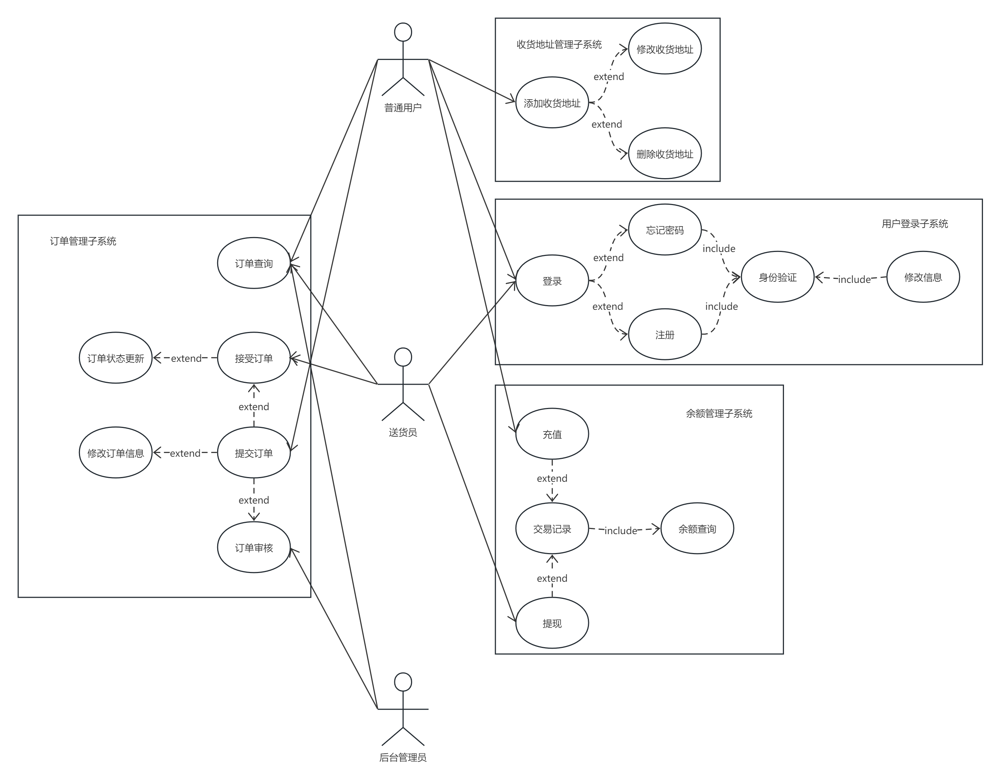
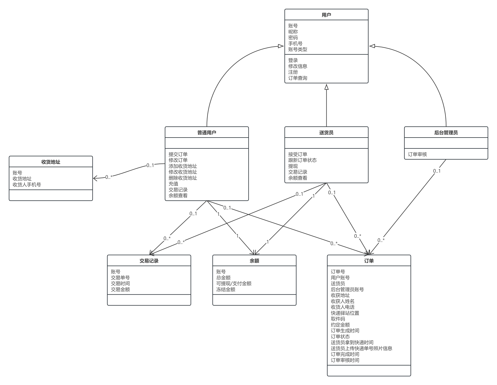
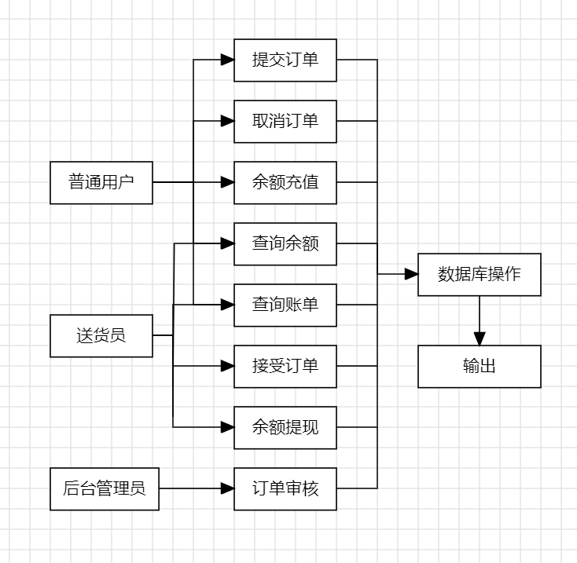

1 引言

### 1.1 编写目的

本概要设计说明书目的是为了确定应该如何具体地实现“快递代拿（FastDeliver）”项目，从而在编码阶段可以把这个描述直接翻译成用具体的程序语言书写的程序。主要的工作有：根据在《需求分析说明书》中所描述的数据、功能、运行、性能需求，并依照《概要设计说明书》所确定的处理流程、总体结构和模块外部设计，设计软件系统的结构设计、逐个模块的程序描述（包括各模块的功能、性能、输入、输出、算法、程序逻辑、接口等等。作为开发人员和测试人员进一步变成和编码测试用例依据。

### 1.2 背景

A. 项目名称是“快递代拿”(FastDeliver)

B. 本项目的任务提出者为软件工程课程快递代拿小组,开发者为该小组中的全部同学,用户为集美大学的在校学生。主要功能是实现用户登录，用户订单，送货员接受订单和订单跟踪，售后订单管理等功能。项目周期为2周。

C. 该软件系统需要与以下系统进行数据交互（TODO）:

* 第三方支付系统:实现学生订单在线支付功能
* 地图导航系统:优化快递

### 1.3 定义（TODO）

### 1.4 参考资料（TODO）

## 2 程序系统的结构

1. 整体用例图

2. 整体类图

## 3 程序1设计说明

### 3.1 程序描述

设计登录界面，依据用户的不同类型进行分类，并提供注册新用户、忘记密码进行修改和更改登录信息等功能。

### 3.2 功能

用户的登录、注册、忘记密码、更改登录信息。

### 3.3 性能

金额精确到0.01元，时间精确到秒，其他数字均精确到整数位

### 3.4 输入项

| **名称** | **标识符**      | **数据类型** | **长度** | **输入方式** |
| ------ | ------------ | -------- | ------ | -------- |
| 账号     | account_id   | char     | 10     | 自动输入     |
| 名称     | Account_name | varchar  | 20     | 自动输入     |
| 密码     | password     | varchar  | 15     | 自动输入     |
| 电话     | phone        | char     | 11     | 自动输入     |
| 用户类型   | Account_type | varchar  | 10     | 自动输入     |

### 3.5 输出项

| **名称** | **标识符**      | **数据类型** | **长度** | **输入方式** |
| ------ | ------------ | -------- | ------ | -------- |
| 账号     | account_id   | char     | 10     | 自动输入     |
| 名称     | Account_name | varchar  | 20     | 自动输入     |
| 密码     | password     | varchar  | 15     | 自动输入     |
| 电话     | phone        | char     | 11     | 自动输入     |
| 用户类型   | Account_type | varchar  | 10     | 自动输入     |

### 3.6 算法

### 3.7 流程逻辑

### 3.8 接口

### 3.9 存储分配

| **名称**   | **标识符**        | **数据类型** | **长度** |
| -------- | -------------- | -------- | ------ |
| 账号       | account_id     | char     | 10     |
| 交易类型     | deal_structure | char     | 4      |
| 交易单号     | deal_id        | char     | 20     |
| 交易金额     | deal_amount    | int      |        |
| 交易时间     | deal_date      | date     |        |
| 总金额      | total_balance  | int      |        |
| 可提现/支付金额 | active_balance | int      |        |
| 冻结金额     | frozen_balance | int      |        |

### 3.10 注释设计

A、在模块首部注释说明模块开始编写的时间、编写人员及其基本功能

B、在变量声明阶段，大概说明变量的类型和用途

### 3.11 限制条件

必须保证程序正常的连接到服务器。

### 3.12 测试设计

1. 测试登录是否能够正确判断用户类型
2. 测试忘记密码是否能成功找回密码
3. 测试注册时否能正常注册新用户

### 3.13 尚未解决的问题

## 4 余额管理子程序设计说明

### 4.1 程序描述

对用户的余额进行修改、对用户的余额及余额变动记录进行查询

### 4.2 功能

### 4.3 性能

金额精确到0.01元，时间精确到秒，其他数字均精确到整数位

### 4.4 输入项

| 名称       | 标识符            | 数据类型 | 长度  | 输入方式 |
| -------- | -------------- | ---- | --- | ---- |
| 账号       | account_id     | char | 10  | 自动输入 |
| 交易类型     | deal_structure | char | 4   | 自动输入 |
| 交易金额     | deal_amount    | int  |     | 自动输入 |
| 总金额      | total_balance  | int  |     | 自动输入 |
| 可提现/支付金额 | active_balance | int  |     | 自动输入 |
| 冻结金额     | frozen_balance | int  |     | 自动输入 |

### 4.5 输出项

| 名称       | 标识符            | 数据类型 | 长度  | 输入方式 |
| -------- | -------------- | ---- | --- | ---- |
| 账号       | account_id     | char | 10  | 自动输入 |
| 交易类型     | deal_structure | char | 4   | 自动输入 |
| 交易单号     | deal_id        | char | 20  | 自动输入 |
| 交易金额     | deal_amount    | int  |     | 自动输入 |
| 交易时间     | deal_date      | date |     | 自动输入 |
| 总金额      | total_balance  | int  |     | 自动输入 |
| 可提现/支付金额 | active_balance | int  |     | 自动输入 |
| 冻结金额     | frozen_balance | int  |     | 自动输入 |

### 4.6 算法

总金额 = 可提现/支付金额 + 冻结金额

接受订单：冻结金额 + 交易金额

提交订单、余额提现：可提现/支付金额 - 交易金额

余额充值、取消订单：可提现/支付金额 + 交易金额

订单审核：冻结金额 - 交易金额、可提现/支付金额 + 交易金额

### 4.7 流程逻辑

### 4.8 接口

### 4.9 存储分配

| 名称       | 标识符            | 数据类型 | 长度  |
| -------- | -------------- | ---- | --- |
| 账号       | account_id     | char | 10  |
| 交易类型     | deal_structure | char | 4   |
| 交易单号     | deal_id        | char | 20  |
| 交易金额     | deal_amount    | int  |     |
| 交易时间     | deal_date      | date |     |
| 总金额      | total_balance  | int  |     |
| 可提现/支付金额 | active_balance | int  |     |
| 冻结金额     | frozen_balance | int  |     |

### 4.10 注释设计

A、在模块首部注释说明模块开始编写的时间、编写人员及其基本功能

B、在变量声明阶段，大概说明变量的类型和用途

### 4.11 限制条件

必须保证程序正常的连接到服务器。

### 4.12 测试设计

1. 测试金额计算是否符合系统逻辑运算法则
2. 测试查询功能是否可以正常使用
3. 测试时间能否正确输出

### 4.13 尚未解决的问题

暂无

## 5 订单管理子系统程序设计说明

### 5.1 程序描述

该子系统涵盖了整个项目中有关订单的功能，为普通用户、送货员、后台管理员涉及订单的业务提供服务。

### 5.2 功能

该子系统的功能涉及三种用户，与其相关功能如下：

1. 普通用户
- 提交订单

- 订单删除

- 订单修改

- 订单列表
2. 送货员
- 接受订单

- 更新订单状态

- 历史订单
3. 后台管理员
- 订单审核

- 订单列表

### 5.3 性能

允许一秒内提交99份订单

### 5.4 输入项

1. 提交订单

| 名称                              | 标识符             | 数据类型     | 长度  | 输入方式 |
| ------------------------------- | --------------- | -------- | --- | ---- |
| 订单号 | order_id        | char     | 10  | 自动输入 |
| 用户账号                            | account_id      | char     | 10  | 自动输入 |
| 地址号                             | address_id      | char     | 10  | 手动输入 |
| 快递驿站位置                          | package_address | varchar  | 100 | 手动输入 |
| 快递单号                            | package_code    | varchar  | 50  | 手动输入 |
| 取件码                             | pickup_code     | varchar  | 20  | 手动输入 |
| 约定金额                            | order_amount    | INT      |     | 自动输入 |
| 订单生成时间                          | order_date      | datetime |     | 自动输入 |
| 订单状态                            | order_status    | int      |     | 自动输入 |

2. 删除订单

| 名称   | 标识符        | 数据类型 | 长度  | 输入方式 |
| ---- | ---------- | ---- | --- | ---- |
| 订单号  | order_id   | char | 10  | 自动输入 |
| 用户账号 | account_id | char | 10  | 自动输入 |

3. 用户获取历史订单列表

| 名称   | 标识符        | 数据类型 | 长度  | 输入方式 |
| ---- | ---------- | ---- | --- | ---- |
| 用户账号 | account_id | char | 10  | 自动输入 |

4. 修改订单

| 名称     | 标识符             | 数据类型    | 长度  | 输入方式 |
| ------ | --------------- | ------- | --- | ---- |
| 订单号    | order_id        | char    | 10  | 自动输入 |
| 用户账号   | account_id      | char    | 10  | 自动输入 |
| 地址号    | address_id      | char    | 10  | 手动输入 |
| 快递驿站位置 | package_address | varchar | 100 | 手动输入 |
| 快递单号   | package_code    | varchar | 50  | 手动输入 |
| 取件码    | pickup_code     | varchar | 20  | 手动输入 |

5. 送货员更改订单状态

| 名称   | 标识符          | 数据类型 | 长度  | 输入方式 |
| ---- | ------------ | ---- | --- | ---- |
| 订单号  | order_id     | char | 10  | 自动输入 |
| 用户账号 | account_id   | char | 10  | 自动输入 |
| 图片信息 | picture_name | char | 100 | 自动输入 |

6. 后台管理员审核订单

| 名称   | 标识符        | 数据类型 | 长度  | 输入方式 |
| ---- | ---------- | ---- | --- | ---- |
| 订单号  | order_id   | char | 10  | 自动输入 |
| 用户账号 | account_id | char | 10  | 自动输入 |

### 5.5 输出项

| 名称            | 标识符                | 数据类型     | 长度  |
| ------------- | ------------------ | -------- | --- |
| 订单号           | order_id           | char     | 10  |
| 用户账号          | account_id         | char     | 10  |
| 送货员账号         | deliver_account_id | char     | 10  |
| 后台管理员账号       | admin_account_id   | char     | 10  |
| 收货地址          | delivery_address   | varchar  | 100 |
| 收货人姓名         | delivery_name      | varchar  | 20  |
| 收货人电话         | delivery_phone     | char     | 11  |
| 快递驿站位置        | package_address    | varchar  | 100 |
| 快递单号          | package_code       | varchar  | 50  |
| 取件码           | pickup_code        | varchar  | 20  |
| 约定金额          | order_amount       | number   |     |
| 订单生成时间        | order_date         | datetime |     |
| 订单状态          | order_status       | int      |     |
| 送货员拿到快递时间     | get_package_time   | datetime |     |
| 送货员上传快递单号照片信息 | picture_name       | varchar  | 100 |
| 订单完成时间        | order_finish_time  | datetime |     |
| 订单审核时间        | audit_time         | datetime |     |

### 5.6 算法

无

### 5.7 流程逻辑

1. 提交订单

由用户提交订单，调用NormalController.newOrder()函数进行处理，由generateOrderNumber()方法生成订单号，调用orderService.newOrder()向数据库插入订单记录。根据返回值生成返回结果。

2. 删除订单

用户删除订单，调用NormalController.deleteOrderList()进行处理，调用接口orderService.deleteOrder()方法删除记录，根据返回值生成返回结果。

3. 修改订单

调用NormalController.modifyOrder(), 调用modifyOrder返回值，根据返回值生成返回结果。

4. 订单列表

使用getOrderList()方法，调用orderService.getOrderList()向查询订单记录，成功返回List<OrderForm>对象，失败则返回error，生成返回结果。

5. 修改订单状态

调用DeliverController.updateStatus()方法，使用orderService.updateStatus()方法修改记录，根据返回值生成返回结果。

### 5.8 接口

| 请求路径                         | 请求参数            | 请求类型 | 响应结果 | 接口说明       |
| ---------------------------- | --------------- | ---- | ---- | ---------- |
| /normal/neworder             | OrderForm order | POST | JSON | 提交订单       |
| /normal/deleteOrder          | String orderId  | POST | JSON | 删除订单       |
| /normal/usergetorderlist     |                 | POST | JSON | 订单列表       |
| /normal/modifyorder          | OrderForm order | POST | JSON | 修改订单       |
| /deliver/deliverGetOrderList |                 | POST | JSON | 历史订单（接单）   |
| /deliver/getacceptorderlist  |                 | POST | JSON | 订单列表（接单）   |
| /deliver/acceptorder         | String orderId  | POST | JSON | 更新订单状态（接单） |
| /deliver/takepackage         | String orderId  | POST | JSON | 更新订单状态（取件） |
| /deliver/finishOrder         | String orderId  | POST | JSON | 更新订单状态（送达） |
| /admin/admingetorderlist     |                 | POST | JSON | 历史订单（审核）   |
| /admin/getfinishorderlist    |                 | POST | JSON | 待审核订单列表    |
| /admin/getallnotendorderlist |                 | POST | JSON | 全部订单       |
| /admin/auditupdate           | String orderId  | POST | JSON | 审核订单       |

### 5.9 存储分配

### 5.10 注释设计

### 5.11 限制条件

### 5.12 测试设计

初步测试计划：

| 接口名称                         | 输入数据                                       | 预期结果      |
| ---------------------------- | ------------------------------------------ | --------- |
| /normal/neworder             | OrderForm order                            | 订单提交成功    |
| /normal/deleteOrder          | String orderId                             | 删除成功      |
| /normal/usergetorderlist     |                                            | orderList |
| /normal/modifyorder          | OrderForm order                            | 订单修改成功    |
| /deliver/deliverGetOrderList |                                            | orderList |
| /deliver/getacceptorderlist  | String orderId                             | orderList |
| /deliver/acceptorder         | String orderIdString orderId               | 接单成功      |
| /deliver/takepackage         | String orderIdString orderIdString orderId | 提交成功      |
| /deliver/finishOrder         |                                            | 提交成功      |
| /admin/admingetorderlist     |                                            | orderList |
| /admin/getallnotendorderlist |                                            | orderList |
| /admin/auditupdate           | String orderId                             | 提交成功      |

### 5.13 尚未解决的问题

## 6 地址管理子系统

### 6.1 程序描述

本子系统主要功能是记录用户地址，为用户提交订单选择地址提供服务。

### 6.2 功能

功能：

- 新增地址

- 删除地址

- 修改地址

- 地址列表

### 6.3 性能

支持多用户在1秒内新增99个地址

### 6.4 输入项

1. 提交地址

| 名称    | 标识符        | 数据类型    | 长度  | 输入方式 |
| ----- | ---------- | ------- | --- | ---- |
| 地址号   | address_id | char    | 10  | 自动输入 |
| { 账号  | account_id | char    | 10  | 自动输入 |
| 地址    | address    | varchar | 100 | 手动输入 |
| 收货人姓名 | name       | varchar | 50  | 手动输入 |
| 电话    | phone      | varchar | 20  | 手动输入 |

2. 删除地址

| 名称   | 标识符        | 数据类型 | 长度  | 输入方式 |
| ---- | ---------- | ---- | --- | ---- |
| 地址号  | address_id | char | 10  | 自动输入 |
| 用户账号 | account_id | char | 10  | 自动输入 |

3. 修改地址

| 名称    | 标识符        | 数据类型    | 长度  | 输入方式 |
| ----- | ---------- | ------- | --- | ---- |
| 地址号   | address_id | char    | 10  | 自动输入 |
| { 账号  | account_id | char    | 10  | 自动输入 |
| 地址    | address    | varchar | 100 | 手动输入 |
| 收货人姓名 | name       | varchar | 50  | 手动输入 |
| 电话    | phone      | varchar | 20  | 手动输入 |

4. 地址列表

| 名称  | 标识符        | 数据类型 | 长度  | 输入方式 |
| --- | ---------- | ---- | --- | ---- |
| 地址号 | address_id | char | 10  | 自动输入 |

### 6.5 输出项

地址列表：

| 名称    | 标识符        | 数据类型    | 长度  |
| ----- | ---------- | ------- | --- |
| 地址号   | address_id | char    | 10  |
| 账号    | account_id | char    | 10  |
| 地址    | address    | varchar | 100 |
| 收货人姓名 | name       | varchar | 50  |
| 电话    | phone      | varchar | 20  |

### 6.6 算法

### 6.7 流程逻辑

1. 新增订单

2. 删除订单

3. 订单列表

4. 修改订单

### 6.8 接口

| 请求路径                   | 请求参数                     | 请求类型 | 响应结果 | 接口说明 |
| ---------------------- | ------------------------ | ---- | ---- | ---- |
| /address/newaddress    | Address address          | POST | JSON | 新增地址 |
| /address/getaddress    |                          | POST | JSON | 地址列表 |
| /address/deleteaddlist | List<String> addressList | POST | JSON | 删除地址 |
| /address/updateaddress | Address address          | POST | JSON | 修改地址 |

### 6.9 存储分配

### 6.10 注释设计

### 6.11 限制条件

### 6.12 测试设计

| 请求路径                   | 请求参数                     | 请求类型        |
| ---------------------- | ------------------------ | ----------- |
| /address/newaddress    | Address address          | 地址添加成功      |
| /address/getaddress    |                          | addressList |
| /address/deleteaddlist | List<String> addressList | 成功删除x条地址    |
| /address/updateaddress | Address address          | 地址修改成功      |

### 6.13 尚未解决的问题