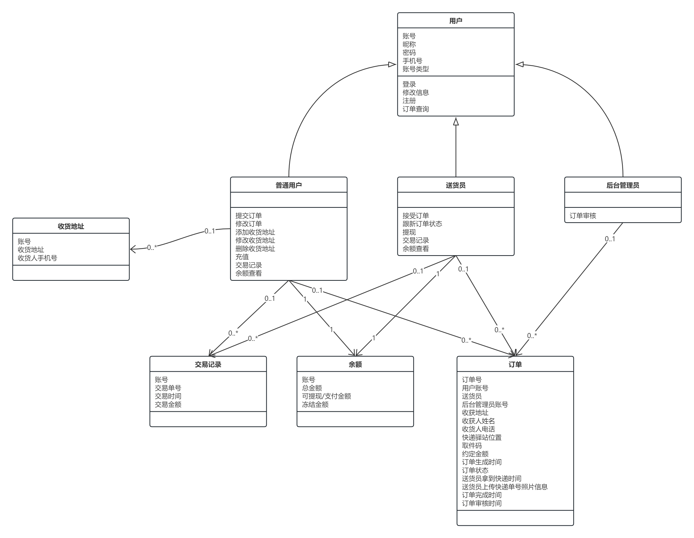

# 1
 
### 1 引言

#### 1.1 目的

本报告的编写目的在于探究快递代拿（FastDeliver）软件开发是否可行，指出开发软件嗦采用的方法和手段，对开发软件的前景进行分析。对项目负责人、开发者的管理和开发拒用重要作用。

#### 1.2 背景

A. 项目名称是“快递代拿”(FastDeliver)

B. 本项目的任务提出者为软件工程课程快递代拿小组,开发者为该小组中的全部同学,用户为集美大学的在校学生。

C. 该软件系统需要与以下系统进行数据交互（TODO）:

* 第三方支付系统:实现学生订单在线支付功能
* 地图导航系统:优化快递

#### 1.3 符号、缩略语和定义（TODO）

#### 1.4 参考资料（TODO）

国标

书

### 2可行性研究的前提

说明对所建议的开发项目进行可行性研究的前提，如要求、目标、假定、限制等。

#### 2.1要求

    功能：用户提交订单、配送员接受订单、查询订单情况、在线支付
    性能：优化快递的配送路径和时间，提高效率和用户体验。
    输出：该系统输出订单信息给配送员，输出账单信息给用户，输出用户需求给管理员；
    输入：用户提交订单时需要输入取货地址、配送地址以及需求；
    在安全与保密方面的要求：用户信息只有用户自己和管理员有可见与修改的权力；
    同本系统相连接的其他系统：与第三方支付系统和地图导航系统之间能够建立有效的数据交互接口。
    完成期限：30天

#### 2.2目标

A.    人力、物力和财力的减少；
B.    配送路径的优化；
C.    提高用户满意度；
D.    提高配送员配送效率；
E.    确保支付的安全性和便利性

#### 2.3条件、假定和限制

说明对这项开发中给出的条件、假定和所受到的限制，如：
a．    所建议系统的运行寿命的最小值：4年；
b．    经费来源：学校资助；
c．    硬件、软件、运行环境和开发环境方面的条件和限制：
 硬件：
服务器： Pentinum III 500及以上；
内存： 128M及以上；
硬盘： 至少10G以上；
打印机一台；
软件：
操作系统为Window 7 或以上，使用Springboot和Vue开发，数据库采用Mysql，项目运行环境为apache2.4
d．    可利用的信息和资源：学校附近快递站点；
e．    系统投入使用的最晚时间：2024.01.01

#### 2.4进行可行性研究的方法

本次可行性研究主要通过市场调查研究法。对集美大学附近快递站点进行调查，为了提高订单配送的效率，以减少不必要的人力物力消耗。

#### 2.5评价尺度

开发费用：开发经费预定在3000元；
各项功能的优先次序：满足管理员、配送员和一般用户的使用；
开发时间：在两周内完成开发和测试工作；
使用中的难易程度：人性化操作，方便使用。

### 3对现有系统的分析

#### 3.1处理流程和数据流程

用户自取

#### 3.2工作负荷

无

#### 3.3费用开支

无

#### 3.4人员

用户本人

#### 3.5设备

无

#### 3.6局限性

无

### 4所建议的系统

本章将用来说明所建议系统的目标和要求将如何被满足。

#### 4.1对所建议系统的说明

快递代拿系统是信息管理系统，通过计算机管理学生快递信息，通过强大的查询和更新、删除来提高办事效率，实现足不出户即可拿到快递。

#### 4.2处理流程和数据流程

用户下单、订单查询、填写地址、提交订单、配送员接受订单、处理订单

#### 4.3改进之处

通过互联网平台使用户只需填写地址即可拿到快递，节省了大量时间。

#### 4.4影响

说明在建立所建议系统时，预期将带来的影响，包括：

##### 4.4.1对设备的影响

无

##### 4.4.2对软件的影响

必须保证操作系统在Windows7以上版本的电脑上运行，以适应系统的需求。

##### 4.4.3对用户单位机构的影响

管理员要求掌握一定的计算机知识.。

##### 4.4.4对系统运行过程的影响

a．    用户的操作规程：提供个人信息
b．    运行中心的操作规程：通过订单信息、电话、姓名、地址来查询用户信息
c．    运行中心与用户之间的关系：通过订单信息、电话、姓名、地址来查询用户信息方便为用户配送
d．    源数据的处理：源数据保存在数据库中，可随机进行查询；
e．    对数据保存的要求，对数据存储、恢复的处理：安全性、完整性、正确性；
f．    输出报告的处理过程、存储媒体和调度方法：每周打印报表管理人员进行检查
g．    系统失效的后果及恢复的处理办法：重启系统
4.4.5对开发的影响
a.    为了支持所建议系统的开发，用户需进行的工作：用户提供个人信息，提交订单、配送员接单
b.    为了建立一个数据库所要求的数据资源：使用Mysql完成对数据库的建设、更新、查询与删除工作；
c.    为了开发和测验所建议系统而需要的计算机资源：系统打包，能够异地发布，完成在系统Windows7以上的电脑上进行测试工作；
d.    所涉及的保密与安全问题：系统对管理员权限进行相应的设置，只有管理员才能登录操作数据。

##### 4.4.6对地点和设施的影响

无

##### 4.4.7对经费开支的影响

软件的开发成本并不大，其他的投入也只是电脑。由于学校的电脑已经普及，所运行已经达到了要求，无需重新开发建设，所以系统开发、运行所需的费用是比较低的。

#### 4.5局限性

开发人员技术限制。

#### 4.6技术条件方面的可行性

a．    在当前的限制条件下，该系统的功能目标能够达到；
b．    利用现有的技术，该系统的功能能够实现；
c．    在规定的期限内，本系统的开发能够完成。

### 5可选择的其他系统方案

扼要说明曾考虑过的每一种可选择的系统方案，包括需开发的和可从国内国外直接购买的，如果没有供选择的系统方案可考虑，则说明这一点。

#### 5.1可选择的系统方案1

参照第4章的提纲，说明可选择的系统方案1，并说明它未被选中的理由。

#### 5.2可选择的系统方案2

按类似5.1条的方式说明第2个乃至第n个可选择的系统方案。

### 6投资及效益分析

#### 6.1支出

对于所选择的方案，说明所需的费用。如果已有一个现存系统，则包括该系统继续运行期间所需的费用。

##### 6.1.1基本建设投资

包括采购、开发和安装下列各项所需的费用，如：
a.    计算机：10000元
b.    房屋和设施：2000元；
c.    数据通讯设备：2000元；
d.    安全与保密设备：2000元；
e.    数据库管理软件：2000元。

##### 6.1.2其他一次性支出

包括下列各项所需的费用，如：
a．    研究（需求的研究和设计的研究）：1000元；
b．    开发计划与测量基准的研究：1000元；
c．    数据库的建立：2000元；
d．    检查费用和技术管理性费用 1000元；
e．    培训费、旅差费以及开发安装人员所需要的一次性支出：3000元；

##### 6.1.3非一次性支出

列出在该系统生命期内按月或按季或按年支出的用于运行和维护的费用，包括：
a．    设备的租金和维护费用：1000元/年；
b．    软件的租金和维护费用：1000元/年；
c．    数据通讯方面的租金和维护费用：1000元/年；
d．    房屋、空间的使用开支：1000元/年；
e．    公用设施方面的开支：1000元/年；
f．    保密安全方面的开支：1000元/年；
g．    其他经常性的支出等：2000元/年。

#### 6.2收益

对于所选择的方案，说明能够带来的收益，这里所说的收益，表现为开支费用的减少或避免、差错的减少、灵活性的增加、动作速度的提高和管理计划方面的改进等，包括；

##### 6.2.1一次性收益

无

##### 6.2.2非一次性收益

节约了大量人力物力

##### 6.2.3不可定量的收益

用户订单收益。

#### 6.3收益／投资比

求出整个系统生命期的收益／投资比值。

#### 6.4投资回收周期

求出收益的累计数开始超过支出的累计数的时间。

#### 6.5敏感性分析

所谓敏感性分析是指一些关键性因素如系统生命期长度、系统的工作负荷量、工作负荷的类型与这些不同类型之间的合理搭配、处理速度要求、设备和软件的配置等变化时，对开支和收益的影响最灵敏的范围的估计。在敏感性分析的基础上做出的选择当然会比单一选择的结果要好一些。

### 7社会因素方面的可行性

本章用来说明对社会因素方面的可行性分析的结果，包括：

#### 7.1法律方面的可行性

本系统作为软件工程这门课程的课程设计，没有签订任何合同，不存在合同责任。所用的东西都是自己的或者公共的，也没有挪用别人的成果，不存在侵犯专利权版权等问题。

#### 7.2使用方面的可行性

给用户带来了极大的便利，配送员也可以以此勤工俭学，软件界面简单明了，使用方便。
8结论
综合各方面原因，我们认为此项目可行的。

# 2

### 1 引言

#### 1.1 编写目的

为了保证项目团队按时保质地完成项目目标，便于项目团队成员更好地了解项目情况，使项目工作开展的各个过程合理有序，有必要以文件化的形式，把对于在项目生命周期内的工作任务范围、各项工作的任务分解、项目团队组织结构、各团队成员的工作责任、团队内外沟通协作方式、开发进度、经费预算、项目内外环境条件、风险对策等内容以书面的方式描述出来，作为项目团队成员以及项目干系人之间的共识与约定，项目生命周期内的所有项目活动的行动基础，项目团队开展和检查项目工作的依据。

本项目开发计划用于从总体上指导“快递代拿（FastDeliver）”项目顺利进行并最终得到通过评审的项目产品。本项目开发计划面向项目组全体成员。

### 1.2 背景

A. 项目名称是“快递代拿”(FastDeliver)

B. 本项目的任务提出者为软件工程课程快递代拿小组,开发者为该小组中的全部同学,用户为集美大学的在校学生。主要功能是实现用户登录，用户订单，送货员接受订单和订单跟踪，售后订单管理等功能。项目周期为2周。

C. 该软件系统需要与以下系统进行数据交互（TODO）:

* 第三方支付系统:实现学生订单在线支付功能
* 地图导航系统:优化快递

#### 1.3 定义（TODO）

#### 1.4 参考资料（TODO）

### 2 项目概述

#### 2.1 工作内容

①做好需求分析、计划分析，确定好开发工具和数据库等。

②做好UI界面的详细设计以及功能模块的设计

③进行数据库的编码以及接口模块的编码

④功能测试，交接用户

#### 2.2主要参加人员

左广展：主要负责后台系统功能的实现，并主要参与UI界面设计、编写各模块代码以及数据库的设计。

许圣宏：主要负责计划说明的撰写，并主要参与登录界面的设计与开发以及代码的编写。

罗松辉：主要负责代码的维护和测试，并主要参与订单页面功能代码的开发与编写。

#### 2.3产品

##### 2.3.1程序

程序名称：快递代拿

编程语言：Java、Vue

存储程序的媒体形式：文本文件

##### 2.3.2文件

快递代拿.exe：为软件本身的包结构，在本地下载解压即可使用。

用户手册.doc：为本软件的功能部分讲解，为用户提供更好的使用体验。

##### 2.3.3服务

培训安装：

特殊用户可上门培训安装（购买后一星期内）

进行用户手册的说明，并有专属客服咨询求助

维护：前期维护半年，后期维护收费

运行支持：试用期三天

##### 2.3.4非移交的产品

可行性报告、项目开发计划、软件需求说明、数据要求说明、测试分析计划、概要设计说明、详细设计说明、数据库设计说明、模块开发册、测试分析报告、开发进度月报、项目开发总结等。

#### 2.4验收标准

A. 确保测试阶段正常完成，并顺利在规定日期内交付项目

B. 用户使用过程中，若遇到问题可得到维护和解答

C. 产品各项指标符合浮球分析中对产品功能等的描述情况

#### 2.5完成项目的最迟期限

完成项目的最迟期限：2023年12月16日

#### 2.6本计划的批准者和批准日期

计划的批准者：袁鹏飞老师

批准日期：2023年12月1日

### 3 实施计划

##### 3.1工作任务的分解与人员分工

数据库设计、后台界面功能的实现、需求分析撰写、功能测试、代码编写：左广展

文件编制、分发工作、软件安装培训、登录系统界面的实现、代码编写：许圣宏

数据库设计、订单系统界面的实现、可行性分析、用户培训、代码编写：罗松辉

#### 3.2接口人员

集美大学计算机工程学院 软件工程 软件22A1班

a.负责本项目同用户的接口人员：左广展

b.负责本项目同本单位各管理机构，如合同计划管理部门、财务部门、质量管理部门等的接口人员：许圣宏

c.负责本项目同个份合同负责单位的接口人员：罗松辉

#### 3.3进度

| 任务名称    | 开始日期      | 完成日期 | 完成标志     |
| ------- | --------- | ---- | -------- |
| 可行性报告   | 2023.12.5 |      | 可行性研究报告  |
| 项目开发计划  | 2023.12.5 |      | 项目开发计划   |
| 软件需求说明  | 2023.12.5 |      | 软件需求说明书  |
| 数据要求说明  |           |      | 数据要求说明书  |
| 测试分析计划  |           |      | 测试分析报告   |
| 概要设计说明  |           |      | 概要设计说明书  |
| 详细设计说明  |           |      | 详细设计说明书  |
| 数据库设计说明 |           |      | 数据库设计说明书 |
| 用户手册    |           |      | 用户手册     |
| 操作手册    |           |      | 操作手册     |
| 模块开发卷   |           |      | 模块开发卷宗   |
| 测试分析报告  |           |      | 测试分析报告   |
| 开发进度月报  |           |      | 开发进度月报   |
| 项目开发总结  |           |      | 项目开发总结报告 |

#### 3.4预算

| 参与人员 | 时间（日） | 预算（元） |
| ---- | ----- | ----- |
| 左广展  | 30    | 1000  |
| 许圣宏  | 30    | 1000  |
| 罗松辉  | 30    | 1000  |

| 人员  | 办公费 | 差旅费 | 机时费 | 资料费 | 通讯设备 | 设备租金 |
| --- | --- | --- | --- | --- | ---- | ---- |
| 左广展 | 300 | 0   | 0   | 150 | 50   | 200  |
| 许圣宏 | 300 | 0   | 0   | 130 | 50   | 200  |
| 罗松辉 | 300 | 0   | 0   | 140 | 50   | 200  |

#### 3.5关键问题

关键问题：

A.用户需求分析：确保充分了解用户对快递取送服务的需求，包括时间、地点、安全等方面的要求。

B.区域覆盖和分配算法：针对不同地区的订单需求和快递员分布，设计有效的分配算法以最大限度地满足用户需求。

C.安全与责任：处理快递商品的安全问题以及运输中的责任归属，包括货物遗失、损坏等情况。

技术难点：

A.实时定位与路线规划：确保实时获取快递员位置信息。

B.数据安全与隐私保护：确保用户个人信息和交易数据的安全性，同时遵循相关隐私保护法规。

风险：

A.竞争压力：快递市场竞争激烈，如果未能提供差异化的服务，可能难以吸引用户和快递员。

B.法律法规风险：需要严格遵守相关快递行业法规，并尽可能降低法律风险和责任风险。

C.技术可靠性：系统出现严重故障或安全漏洞可能导致用户流失和声誉受损。

### 4 支持条件

#### 4.1计算机系统支持

硬件：

服务器： Pentinum III 500及以上；

内存： 128M及以上；

硬盘： 至少10G以上；

打印机一台；

软件：

操作系统为Window 7 或以上，使用Springboot和Vue开发，数据库采用Mysql，项目运行环境为apache2.4

#### 4.2需由用户承担的工作

1. 用户需求调研和定义：

   用户需要配合开发团队进行需求调研和定义，提供关于快递取送服务的具体需求和要求。

   时间要求：需用户配合开发团队，确保在项目启动初期完成需求调研，一般为2周至1个月时间。

2. 用户界面设计确认：

   需要用户参与用户界面设计的确认和反馈，以确保设计符合用户习惯和操作习惯。

   时间要求：用户需在设计方案提出后的1周内提供确认或反馈意见。

3. 测试数据准备：

   用户需要提供真实的测试数据，包括模拟的订单信息、快递员信息等，用于系统功能测试和验收测试。

   时间要求：在系统开发初期，用户需要准备测试数据，并根据开发进度及时更新。

4. 系统功能验收测试：

   用户需要参与功能性测试和验收测试，提供系统使用中遇到的问题、建议和改进建议。

   时间要求：在开发的后期阶段，用户需要按时参与验收测试，及时反馈测试结果。

5. 业务流程落地支持：

   用户需要准备好相关业务流程的支持措施，确保系统上线后能够顺利落地并正常使用。

   时间要求：在系统上线前，用户需要完成相关业务流程的调整和准备工作。

6. 培训和支持团队：

   用户需要提供培训和支持团队，包括操作培训、技术支持、售后服务等。

时间要求：在系统上线前，用户需安排好培训和支持团队，并配合开发团队进行培训工作。

#### 4.3由外单位提供的条件

本项目为独立开发，不需要外单位提供条件。

### 5 专题计划要点

#### 5.1开发人员培训计划

2023年12月6日起，至2023年12月16日，共七天实习期间，上午进行软件工程各项目开发内容的讨论，下午进行开发设计。

#### 5.2测试计划

2023年12月16日——2023年12月20日对软件进行各项测试工作。

#### 5.3质量保证计划

严格按照项目开发过程中的各项步骤，从项目立项，可行性研究报告、需求分析报告、项目开发计划等具体实施。

#### 5.4人员配置计划

该项目开发小组共3人：

组长：左广展

组员：许圣宏、罗松辉。

#### 5.5用户培训计划

在软件积极应用后的前一个月，对用户进行软件操作方法的具体培训。

#### 5.6安全保密计划

在从项目开发阶段到最后软件的正式发布期间，做好项目的保密工作，小组成员对所有项目所有相关文档进行加密，做好备份工作。

#### 5.7合同计划

与用户协商签订软件使用合同。

# 3

### 1 引言

#### 1.1 编写目的

本软件需求说明书的目的是明确详细地描述“快递代拿（FastDeliver）”项目的总体业务需求和功能需求。文档的目标读者为项目的全体成员。帮助读者正确且全面地了解该软件系统要达成的业务目标,必须支持的主要功能,以及非功能性需求。这有助于在后续的设计、编码和测试阶段满足用户的实际需求。同时也有助于各相关方对整个项目有一个共同的认知。本文档附带的用例描述、数据流图等模型与描述同样对于帮助相关方理解该系统的业务流程与功能具有重要意义。

#### 1.2 背景

A. 项目名称是“快递代拿”(FastDeliver)

B. 本项目的任务提出者为软件工程课程快递代拿小组,开发者为该小组中的全部同学,用户为集美大学的在校学生。主要功能是实现用户登录，用户订单，送货员接受订单和订单跟踪，售后订单管理等功能。项目周期为2周。

C. 该软件系统需要与以下系统进行数据交互（TODO）:

* 第三方支付系统:实现学生订单在线支付功能
* 地图导航系统:优化快递

#### 1.3 定义（TODO）

#### 1.4 参考资料（TODO）

### 2 任务概述

#### 2.1 目标

##### 2.1.1市场目标

项目的市场目标是满足集美大学在校学生对于快递代拿服务的需求，以提供更加便捷、高效的生活方式。通过在校园内推广和提供可靠的快递代拿服务，我们旨在建立并巩固在集美大学校园内的用户群体，成为学生们日常生活中不可或缺的服务平台。市场目标的实现将通过以下方面来衡量：

1. **用户覆盖率提升：** 在项目启动后，我们将追求在集美大学校园内获得更高的用户覆盖率，吸引更多学生成为我们的快递代拿服务用户。

2. **用户满意度：** 通过用户反馈、评价和调查，我们将关注并不断提高用户满意度，确保用户对我们的服务感到满意，形成口碑传播。

3. **市场份额增长：** 我们的目标是逐步扩大在集美大学校园内的市场份额，成为该领域的领先服务提供商。

##### 2.1.2 技术目标

客户端-普通用户：用户能够正常注册、登录，容易理解软件逻辑，进行充值操作，并成功提交订单。

客户端-送货员：送货员能够正常注册、登录，能够正常的接受订单，更新订单状态，并成功完成订单，能够对余额进行提现。

后台管理系统：希望能够查看所有订单，并对订单进行跟踪，并处理来自用户、送货 员的售后请求。

#### 2.2 用户的特点

##### 2.2.1 客户端-普通用户

1. **地理需求:** 主要集中在宿舍距离快递驿站较远的学生群体，他们更容易感受到取快递的不便之处。
2. **支付意愿:** 具有一定经济实力，意支付一定金额来换取他人代取快递的服务。
3. **时间紧迫:** 有对时间的迫切需求，可能是因为学业繁忙或其他活动，因此寻求更为高效的快递取送方式。
4. **用户年龄:** 在校学生，年龄涵盖大学的各个年级。

##### 2.2.2 客户端-送货员

1. **时间灵活:** 具有较多空闲时间，愿意兼职，可以配合用户的下单需求进行取送快递。
2. **学生身份:** 在校学生，因此了解各快递驿站和宿舍位置，并且对于学生的生活、需求较为理解，便于与普通用户建立更好的沟通和信任关系。
3. **希望兼职:** 寻求额外的收入来源，愿意通过服务他人来实现自己的兼职目标。
4. **服务态度:** 具备良好的服务态度，理解用户需求，能够保持友好、高效的服务。

##### 2.2.3 后台管理系统

1. **计算机熟练操作者:** 熟悉计算机操作，能够迅速适应和理解管理系统的用户界面。

2. **沟通技巧:** 具备良好的沟通技能，能够清晰表达问题、需求和建议。这对于与其他系统用户、技术支持团队和系统管理员的协作至关重要。

3. **用户服务导向:** 注重用户体验，能够理解和关注用户需求，以提供更好的服务。对用户提出的请求和问题做出及时响应。

#### 2.3 假定和约束（TODO）

经费限制：云服务器租用费用；

开发期限：2周；

硬件限制：客户端与后台管理系统通过浏览器以网站的形式访问；

运行环境：服务端运行于ubuntu linux操作系统；

### 3 需求规定

#### 3.1 对功能的规定

##### 3.1.1 系统功能组成

快递代拿（FastDeliver）服务系统包含以下子系统：

1. 用户登录子系统：包含用户的登录、注册、忘记密码、更改登录信息等功能；

2. 收获地址管理子系统：包含添加收获地址、删除收获地址、修改收获地址等功能；

3. 余额管理子系统：包含余额查询、交易记录查询、充值等功能；

4. 订单管理子系统：包含与普通用户有关的提交订单、取消订单、订单查询、订单状态查看等功能，与送货员相关的接受订单、订单状态更新、订单查询等功能，与后台管理员相关的订单跟踪、订单审核等功能；

##### 3.1.2 功能描述

###### 3.1.2.1 用户管理子系统

1. 用户范围

普通用户、快递员、系统管理员

2. 功能
- 注册

- 登录

- 修改密码

- 修改账号信息
3. 用例模式图

4. 状态图

###### 3.1.2.2 收货地址管理子系统

1. 用户范围

普通用户

2. 功能
- 添加收获地址

- 删除收获地址

- 修改收获地址
3. 用例模式图

4. 状态图

###### 3.1.2.3 余额管理子系统（TODO）

1. 用户范围

普通用户、送货员

2. 余额查询
- 余额查询

- 交易记录查询

- 充值等功能
3. 用例图

4. 状态图
   
   

###### 3.1.2.4 订单管理子系统（TODO）

1. 用户范围

普通用户、送货员、系统管理员

2. 功能
- 普通用户
  
  - 提交订单
  
  - 取消订单
  
  - 历史订单
  
  - 订单详情

- 送货员
  
  - 接受订单
  
  - 订单状态更新
  
  - 历史订单
  
  - 订单详情

- 系统管理员
  
  - 订单列表
  
  - 订单详情
  
  - 订单审核
3. 用例图

4. 状态图

##### 3.1.3 数据需求

###### 3.1.3.1 静态数据

1. 使用数据库存储用户、地址、订单、金额等各项信息；

2. 建立专门的资源文件夹存储UI界面用到的图片、字体等素材；

3. 使用阿里云oss对象存储存储系统运行过程中由用户产生的图片。

###### 3.1.3.2 动态数据

用户注册登录时提供的账户与密码；

用户修改账号信息，如手机号、邮箱、密码；

用户进入主界面时系统自动获取当前时间信息；

普通用户提交订单时的订单信息；

普通用户提交订单时系统生成的订单号、下单时间、订单状态、余额变动等信息；

普通用户取消订单时系统生成的退款时间与退款订单状态信息；

普通用户确认收获时产生的订单状态信息；

普通用户在充值时产生的余额变动信息、交易记录信息；

送货员在接受订单时由系统生成的接单时间等信息；

送货员在订单状态更新时的订单状态、对应状态的时间信息；

送货员在提现时生成的余额变动信息，交易记录信息；

后台管理员在对完成订单审核时产生的送货员的余额变动信息；

###### 3.1.3.3 数据字典

用户管理

| 数据名 | 数据类型    | 说明              |
| --- | ------- | --------------- |
| 账号  | INT     | 由系统生成，作为用户的唯一标识 |
| 昵称  | VARCHAR | 由用户自定义          |
| 密码  | VARCHAR | 账号验证的依据         |
| 手机号 | VARCHAR | 作为用户身份验证的依据     |

余额表

| 数据名      | 数据类型    | 说明                                          |
| -------- | ------- | ------------------------------------------- |
| 账号       | VARCHAR | 作为外键与用户表关联，标识该条记录的归属                        |
| 总金额      | INT     | 可提现/支付余额和冻结金额总和                             |
| 可提现/支付金额 | INT     |                                             |
| 冻结金额     | INT     | 用户提交订单后冻结订单相应金额/送货员完成订单后后台管理员订单审核前冻结的订单相应金额 |

交易记录表

| 数据名  | 数据类型 | 说明                    |
| ---- | ---- | --------------------- |
| 交易单号 | INT  | 由系统生成，作为交易记录的唯一标识     |
| 账号   | INT  | 作为外键与用户表关联，该条交易记录的归属方 |
| 交易时间 | DATE |                       |
| 交易金额 | DATE |                       |

订单表

| 数据名           | 数据类型    | 说明                                               |
| ------------- | ------- | ------------------------------------------------ |
| 订单号           | INT     | 由系统生成，作为订单的唯一标识                                  |
| 用户账号          | INT     | 标识该订单的下单方                                        |
| 送货员账号         | INT     | 标识该订单的送货员方                                       |
| 后台管理员账号       | INT     | 标识该订单的审核方                                        |
| 收获地址          | VARCHAR |                                                  |
| 收获人姓名         | VARCHAR |                                                  |
| 收货人电话         | VARCHAR |                                                  |
| 快递驿站位置        | VARCHAR |                                                  |
| 取件码           | VARCHAR |                                                  |
| 约定金额          | INT     |                                                  |
| 订单生成时间        | DATE    |                                                  |
| 订单状态          | INT     | /待接受/待取件/已取件/待审核/订单完成（在“待审核状态下，对普通欧纳古来说时订单完成状态”） |
| 送货员拿到快递时间     | DATE    |                                                  |
| 送货员上传快递单号照片信息 | VARCHAR |                                                  |
| 订单完成时间        | DATE    | 这只是对普通用户来说的，对送货员来说这个是送达时间                        |
| 订单审核时间        | DATE    |                                                  |

###### 3.1.3.4 数据库描述

数据库实体联系E-R图

#### 3.2 对性能的规定

##### 3.2.1 精度

输入的数据：多数的数据类型为整数和字符型。在精度需求上，根据使用需要，在各项数据的输入，输出及传输过程中，可以满足各种精度的需求。

##### 3.2.2 时间特性要求

a．  响应时间：0.5s

b．  更新处理时间：0.5s

c．  数据的转换和传送时间：1s

##### 3.2.3 灵活性

说明对该软件的灵活性的要求，即当需求发生某些变化时，该软件对这些变化的适应能力，如：

a．  操作方式上的变化：可以手动输入地址，也可以从曾用地址选择

b．  运行环境的变化：应该在windows 7系统版本上，适用于现有的流行系统

c．  同其他软件的接口的变化

d．  精度和有效时限的变化可以满足不同用户不同精度

e．  计划的变化或改进：根据用户的需求不断的对软件进行升级和更新

对于为了提供这些灵活性而进行的专门设计的部分应该加以标明。

### 4 运行环境规定

硬件：

服务器： Pentinum III 500及以上；

内存： 128M及以上；

硬盘： 至少10G以上；

打印机一台；

软件：

操作系统为Window 7 或以上，使用Springboot和Vue开发，数据库采用Mysql，项目运行环境为apache2.4

# 4

### 1 引言

#### 1.1 编写目的

本数据要求说明书的目的是明确详细地描述“快递代拿（FastDeliver）”项目的数据的逻辑和数据采集。文档的目标读者为项目的全体成员。本文档将详细描述项目中所需的数据,包括用户数据、订单数据、交易数据、余额数据等。同时将说明数据之间的关系,数据采集的渠道和方式，帮助相关方理解该系统的业务流程与功能具有重要意义。

#### 1.2 背景

A. 项目名称是“快递代拿”(FastDeliver)

B. 本项目的任务提出者为软件工程课程快递代拿小组,开发者为该小组中的全部同学,用户为集美大学的在校学生。主要功能是实现用户登录，用户订单，送货员接受订单和订单跟踪，售后订单管理等功能。项目周期为2周。

C. 该软件系统需要与以下系统进行数据交互（TODO）:

* 第三方支付系统:实现学生订单在线支付功能
* 地图导航系统:优化快递

#### 1.3 定义（TODO）

#### 1.4 参考资料（TODO）

### 2 数据的逻辑描述

#### 2.1 静态数据

| 数据名称         | 数据描述               | 数据来源 | 数据去向 |
| ------------ | ------------------ | ---- | ---- |
| account_id   | 账号，由系统生成，作为用户的唯一标识 | 注册   | 登录   |
| account_type | 账号类型，作为判断用户类型的标识   | 注册   | 登录   |

#### 2.2 动态输入数据

| 数据名称              | 数据描述                                 | 数据来源                     | 数据去向  |
| ----------------- | ------------------------------------ | ------------------------ | ----- |
| account_name      | 昵称，由用户自定义                            | 注册、信息修改                  | 用户表   |
| password          | 密码，账号验证的依据                           | 注册、信息修改                  | 用户表   |
| phone             | 手机号，作为用户身份验证的依据                      | 注册、信息修改                  | 用户表   |
| total_balance     | 总余额，可提现/支付余额和冻结金额总和                  | 余额变动                     | 余额表   |
| active_balance    | 可提现/支付余额                             | 余额变动                     | 余额表   |
| frozen_balance    | 冻结余额，送货员完成订单后后台管理员订单审核前冻结的订单相应金额     | 余额变动                     | 余额表   |
| deal_id           | 交易单号，由系统生成，作为交易记录的唯一标识               | 用户提交订单、送货员接受订单           | 交易记录表 |
| deal_date         | 交易时间                                 | 用户提交订单、送货员接受订单           | 交易记录表 |
| deal_amount       | 交易金额                                 | 用户提交订单、送货员接受订单           | 交易记录表 |
| order_id          | 订单号                                  | 用户提交订单                   | 订单表   |
| delivery_address  | 收获地址                                 | 用户提交订单                   | 订单表   |
| delivery_phone    | 收获人电话                                | 用户提交订单                   | 订单表   |
| package_address   | 快递驿站位置                               | 用户提交订单                   | 订单表   |
| pickup_code       | 取件码                                  | 用户提交订单                   | 订单表   |
| tacking_number    | 快递单号                                 | 用户提交订单                   | 订单表   |
| order_amount      | 订单金额                                 | 用户提交订单                   | 订单表   |
| order_date        | 下单日期                                 | 用户提交订单                   | 订单表   |
| order_status      | 订单状态                                 | 用户提交订单、送货员修改订单状态、后台管理员审核 | 订单表   |
| get_package_time  | 取货日期                                 | 送货员修改订单状态                | 订单表   |
| picture_name      | 照片信心，送货员需提交一张取到的快递照片，改信息用于再服务器中找到该照片 | 送货员修改订单状态                | 订单表   |
| order_finish_time | 订单完成日期                               | 送货员修改订单状态                | 订单表   |
| audit_time        | 订单审核日期                               | 后台管理员审核                  | 订单表   |

#### 2.5 数据约定（TODO）

#### 3 数据的采集

#### 3.1 要求和范围

| 数据名称         | 数据要求       | 数据范围 |
| ------------ | ---------- | ---- |
| account_id   | 10位的字符串    |      |
| account_name | 长度不超过10个字符 |      |
| password     | 长度不超过15个字符 |      |

#### 3.2 输入的承担者

普通用户、送货员和后台管理员均为输入的承担者。

#### 3.3 预处理

获取到的系统时间戳需转换为格式为的YYYY/MM/dd/hh/mm的格式。

#### 3.4 影响

无影响。

# 5

### 1 引言

#### 1.1 编写目的

本概要设计目的是为了解决了实现“快递代拿（FastDeliver）”项目需求的程序模块设计问题。包括如何把该系统划分成若干个模块、决定各个模块之间的接口、模块之间传递的信息，以及数据结构、模块结构的设计等。作为开发人员和测试人员进一步变成和编写测试用例依据。

#### 1.2 背景

A. 项目名称是“快递代拿”(FastDeliver)

B. 本项目的任务提出者为软件工程课程快递代拿小组,开发者为该小组中的全部同学,用户为集美大学的在校学生。主要功能是实现用户登录，用户订单，送货员接受订单和订单跟踪，售后订单管理等功能。项目周期为2周。

C. 该软件系统需要与以下系统进行数据交互（TODO）:

* 第三方支付系统:实现学生订单在线支付功能
* 地图导航系统:优化快递

#### 1.3 定义（TODO）

#### 1.4 参考资料（TODO）

### 2 总体设计

#### 2.1 需求规定

##### 2.1.1 用户登录子系统

1. 主要输入

注册信息、登录信息、修改信息。

2. 主要输出

个人主页的信息展示。

3. 主要功能

用户的登录、注册、忘记密码、更改登录信息。

##### 2.1.2 收货地址管理子系统

1. 主要输入

添加收获地址信息、删除收货地址信息、修改收获地址信息

2. 主要输出

选择收货地址

3. 主要功能

添加收获地址、删除收货地址、修改收获地址

##### 2.1.3 余额管理子系统

1. 主要输入

充值信息、交易信息

2. 主要输出

交易记录查询、余额查询

3. 主要功能

充值、交易记录查询、余额查询

##### 2.1.4 订单管理子系统

1. 主要输入

普通用户提交订单信息、普通用户修改订单信息、送货员接受订单信息、送货员更新订单状态信息、后台管理员审核订单信息

2. 主要输出

订单查询、订单跟踪

3. 主要功能

普通用户有关的提交订单、取消订单、订单查询、订单状态查看等功能，与送货员相关的接受订单、订单状态更新、订单查询等功能，与后台管理员相关的订单跟踪、订单审核等功能

#### 2.2运行环境

服务器：阿里云轻量型应用服务器vCPU: 2核，内存：1GB，ESSD：40GB

系统：Ubuntu22.04

#### 2.3基本设计概念和处理流程（TODO）

用例图

#### 2.4 结构

类图

#### 2.5 人工处理过程

订单审核，需要后台管理员检查送货员上传的快递照片中的快递单号与用户上传的的快递单号是否一致。

#### 2.6 尚未解决的问题

无

### 3 接口设计

#### 3.1 用户接口

| 接口名称   | 实现功能           | 调用方法 | 答复      |
| ------ | -------------- | ---- | ------- |
| 登录     | 用户登录           | POST | Boolean |
| 提交订单   | 普通用户提交订单       | POST | Boolean |
| 修改订单   | 修改已提交的订单       | POST | Boolean |
| 注册     | 用户注册           | POST | Boolean |
| 忘记密码   | 用户重置密码         | POST | Boolean |
| 更改登录信息 | 用户修改用户名或密码     | POST | Boolean |
| 添加收获地址 | 普通用户添加新的收获地址   | POST | Boolean |
| 删除收获地址 | 普通用户删除已有的收获地址  | POST | Boolean |
| 修改收获地址 | 普通用户修改已有的收获地址  | POST | Boolean |
| 余额查询   | 用户查看自己的账户余额    | GET  | Number  |
| 交易记录查询 | 用户查看自己的交易历史    | GET  | Array   |
| 充值     | 普通用户向自己的账户充值   | POST | Boolean |
| 取消订单   | 普通普通用户取消已提交的订单 | POST | Boolean |
| 订单查询   | 普通用户或送货员查询订单详情 | GET  | Object  |
| 订单状态查看 | 普通用户查看订单的当前状态  | GET  | String  |
| 接受订单   | 送货员接受待配送的订单    | POST | Boolean |
| 订单状态更新 | 送货员更新订单的配送状态   | POST | Boolean |
| 订单跟踪   | 后台管理员跟踪订单的整个流程 | GET  | Object  |
| 订单审核   | 后台管理员审核订单的合法性  | POST | Boolean |

#### 3.2 外部接口

本系统不包含外部接口。

#### 3.3 内部接口

系统内部与数据库连接接口为SQL链接

### 4 运行设计

#### 4.1 运行模块组合

普通用户：注册模块、登录模块、信息修改模块、提交订单模块、收货地址模块、订单修改模块、订单查询模块、充值模块、余额查询模块。

送货员：注册模块、登录模块、信息修改模块、接受订单模块、订单状态更新模块、订单查询模块、提现模块、余额查询模块。

后台管理员：注册模块、登录模块、信息修改模块、订单审核模块、订单查询模块

#### 4.2 运行控制

登录模块需要进行用户名、密码、用户级别的验证。

订单状态更新需要送货员根据送货流程填写。

订单审核需要后台管理员根据订单判断。

### 5 系统数据结构设计

1. 用户表

| 名称   | 标识符          | 数据类型        | 长度  |
| ---- | ------------ | ----------- | --- |
| 账号   | account_id   | char        | 10  |
| 昵称   | account_name | nvarchar    | 20  |
| 密码   | password     | varchar     | 15  |
| 手机号  | phone        | char        | 11  |
| 账号类型 | account_type | enum(1,2,3) |     |

2. 交易记录表

| 名称   | 标识符            | 数据类型    | 长度  |
| ---- | -------------- | ------- | --- |
| 账号   | account_id     | char    | 10  |
| 交易类型 | deal_structure | varchar | 4   |
| 交易单号 | deal_id        | char    | 10  |
| 交易金额 | deal_amount    | int     |     |
| 交易时间 | deal_date      | date    |     |

3. 余额表

| 名称       | 标识符            | 数据类型 | 长度  |
| -------- | -------------- | ---- | --- |
| 账号       | account_id     | char | 10  |
| 总金额      | total_balance  | int  |     |
| 可提现/支付金额 | active_balance | int  |     |
| 冻结金额     | frozen_balance | int  |     |

4. 地址表

| 名称     | 标识符        | 数据类型    | 长度  |
| ------ | ---------- | ------- | --- |
| 账号     | account_id | char    | 10  |
| 收货地址   | address    | varchar | 100 |
| 收货人手机号 | phone      | char    | 11  |

4. 订单表

| 名称            | 标识符                | 数据类型     | 长度  |
| ------------- | ------------------ | -------- | --- |
| 订单号           | order_id           | char     | 10  |
| 用户账号          | account_id         | char     | 10  |
| 送货员账号         | deliver_account_id | char     | 10  |
| 后台管理员账号       | admin_account_id   | char     | 10  |
| 收货地址          | delivery_address   | varchar  | 100 |
| 收货人姓名         | delivery_name      | varchar  | 20  |
| 收货人电话         | delivery_phone     | char     | 11  |
| 快递驿站位置        | package_address    | varchar  | 100 |
| 快递单号          | package_code       | varchar  | 50  |
| 取件码           | pickup_code        | varchar  | 20  |
| 约定金额          | order_amount       | number   |     |
| 订单生成时间        | order_date         | datetime |     |
| 订单状态          | order_status       | int      |     |
| 送货员拿到快递时间     | get_package_time   | datetime |     |
| 送货员上传快递单号照片信息 | picture_name       | varchar  | 100 |
| 订单完成时间        | order_finish_time  | datetime |     |
| 订单审核时间        | audit_time         | datetime |     |

# 6

1 引言

#### 1.1 编写目的

本概要设计说明书目的是为了确定应该如何具体地实现“快递代拿（FastDeliver）”项目，从而在编码阶段可以把这个描述直接翻译成用具体的程序语言书写的程序。主要的工作有：根据在《需求分析说明书》中所描述的数据、功能、运行、性能需求，并依照《概要设计说明书》所确定的处理流程、总体结构和模块外部设计，设计软件系统的结构设计、逐个模块的程序描述（包括各模块的功能、性能、输入、输出、算法、程序逻辑、接口等等。作为开发人员和测试人员进一步变成和编码测试用例依据。

#### 1.2 背景

A. 项目名称是“快递代拿”(FastDeliver)

B. 本项目的任务提出者为软件工程课程快递代拿小组,开发者为该小组中的全部同学,用户为集美大学的在校学生。主要功能是实现用户登录，用户订单，送货员接受订单和订单跟踪，售后订单管理等功能。项目周期为2周。

C. 该软件系统需要与以下系统进行数据交互（TODO）:

* 第三方支付系统:实现学生订单在线支付功能
* 地图导航系统:优化快递

#### 1.3 定义（TODO）

#### 1.4 参考资料（TODO）

### 2 程序系统的结构

1. 整体用例图

2. 整体类图

### 3 程序1设计说明

#### 3.1 程序描述

设计登录界面，依据用户的不同类型进行分类，并提供注册新用户、忘记密码进行修改和更改登录信息等功能。

#### 3.2 功能

用户的登录、注册、忘记密码、更改登录信息。

#### 3.3 性能

金额精确到0.01元，时间精确到秒，其他数字均精确到整数位

#### 3.4 输入项

| **名称** | **标识符**      | **数据类型** | **长度** | **输入方式** |
| ------ | ------------ | -------- | ------ | -------- |
| 账号     | account_id   | char     | 10     | 自动输入     |
| 名称     | Account_name | varchar  | 20     | 自动输入     |
| 密码     | password     | varchar  | 15     | 自动输入     |
| 电话     | phone        | char     | 11     | 自动输入     |
| 用户类型   | Account_type | varchar  | 10     | 自动输入     |

#### 3.5 输出项

| **名称** | **标识符**      | **数据类型** | **长度** | **输入方式** |
| ------ | ------------ | -------- | ------ | -------- |
| 账号     | account_id   | char     | 10     | 自动输入     |
| 名称     | Account_name | varchar  | 20     | 自动输入     |
| 密码     | password     | varchar  | 15     | 自动输入     |
| 电话     | phone        | char     | 11     | 自动输入     |
| 用户类型   | Account_type | varchar  | 10     | 自动输入     |

#### 3.6 算法

#### 3.7 流程逻辑

#### 3.8 接口

#### 3.9 存储分配

| **名称**   | **标识符**        | **数据类型** | **长度** |
| -------- | -------------- | -------- | ------ |
| 账号       | account_id     | char     | 10     |
| 交易类型     | deal_structure | char     | 4      |
| 交易单号     | deal_id        | char     | 20     |
| 交易金额     | deal_amount    | int      |        |
| 交易时间     | deal_date      | date     |        |
| 总金额      | total_balance  | int      |        |
| 可提现/支付金额 | active_balance | int      |        |
| 冻结金额     | frozen_balance | int      |        |

#### 3.10 注释设计

A、在模块首部注释说明模块开始编写的时间、编写人员及其基本功能

B、在变量声明阶段，大概说明变量的类型和用途

#### 3.11 限制条件

必须保证程序正常的连接到服务器。

#### 3.12 测试设计

1. 测试登录是否能够正确判断用户类型
2. 测试忘记密码是否能成功找回密码
3. 测试注册时否能正常注册新用户

#### 3.13 尚未解决的问题

### 4 余额管理子程序设计说明

#### 4.1 程序描述

对用户的余额进行修改、对用户的余额及余额变动记录进行查询

#### 4.2 功能

#### 4.3 性能

金额精确到0.01元，时间精确到秒，其他数字均精确到整数位

#### 4.4 输入项

| 名称       | 标识符            | 数据类型 | 长度  | 输入方式 |
| -------- | -------------- | ---- | --- | ---- |
| 账号       | account_id     | char | 10  | 自动输入 |
| 交易类型     | deal_structure | char | 4   | 自动输入 |
| 交易金额     | deal_amount    | int  |     | 自动输入 |
| 总金额      | total_balance  | int  |     | 自动输入 |
| 可提现/支付金额 | active_balance | int  |     | 自动输入 |
| 冻结金额     | frozen_balance | int  |     | 自动输入 |

#### 4.5 输出项

| 名称       | 标识符            | 数据类型 | 长度  | 输入方式 |
| -------- | -------------- | ---- | --- | ---- |
| 账号       | account_id     | char | 10  | 自动输入 |
| 交易类型     | deal_structure | char | 4   | 自动输入 |
| 交易单号     | deal_id        | char | 20  | 自动输入 |
| 交易金额     | deal_amount    | int  |     | 自动输入 |
| 交易时间     | deal_date      | date |     | 自动输入 |
| 总金额      | total_balance  | int  |     | 自动输入 |
| 可提现/支付金额 | active_balance | int  |     | 自动输入 |
| 冻结金额     | frozen_balance | int  |     | 自动输入 |

#### 4.6 算法

总金额 = 可提现/支付金额 + 冻结金额

接受订单：冻结金额 + 交易金额

提交订单、余额提现：可提现/支付金额 - 交易金额

余额充值、取消订单：可提现/支付金额 + 交易金额

订单审核：冻结金额 - 交易金额、可提现/支付金额 + 交易金额

#### 4.7 流程逻辑

#### 4.8 接口

#### 4.9 存储分配

| 名称       | 标识符            | 数据类型 | 长度  |
| -------- | -------------- | ---- | --- |
| 账号       | account_id     | char | 10  |
| 交易类型     | deal_structure | char | 4   |
| 交易单号     | deal_id        | char | 20  |
| 交易金额     | deal_amount    | int  |     |
| 交易时间     | deal_date      | date |     |
| 总金额      | total_balance  | int  |     |
| 可提现/支付金额 | active_balance | int  |     |
| 冻结金额     | frozen_balance | int  |     |

#### 4.10 注释设计

A、在模块首部注释说明模块开始编写的时间、编写人员及其基本功能

B、在变量声明阶段，大概说明变量的类型和用途

#### 4.11 限制条件

必须保证程序正常的连接到服务器。

#### 4.12 测试设计

1. 测试金额计算是否符合系统逻辑运算法则
2. 测试查询功能是否可以正常使用
3. 测试时间能否正确输出

#### 4.13 尚未解决的问题

暂无

### 5 订单管理子系统程序设计说明

#### 5.1 程序描述

该子系统涵盖了整个项目中有关订单的功能，为普通用户、送货员、后台管理员涉及订单的业务提供服务。

#### 5.2 功能

该子系统的功能涉及三种用户，与其相关功能如下：

1. 普通用户
- 提交订单

- 订单删除

- 订单修改

- 订单列表
2. 送货员
- 接受订单

- 更新订单状态

- 历史订单
3. 后台管理员
- 订单审核

- 订单列表

#### 5.3 性能

允许一秒内提交99份订单

#### 5.4 输入项

1. 提交订单

| 名称     | 标识符             | 数据类型     | 长度  | 输入方式 |
| ------ | --------------- | -------- | --- | ---- |
| 订单号    | order_id        | char     | 10  | 自动输入 |
| 用户账号   | account_id      | char     | 10  | 自动输入 |
| 地址号    | address_id      | char     | 10  | 手动输入 |
| 快递驿站位置 | package_address | varchar  | 100 | 手动输入 |
| 快递单号   | package_code    | varchar  | 50  | 手动输入 |
| 取件码    | pickup_code     | varchar  | 20  | 手动输入 |
| 约定金额   | order_amount    | INT      |     | 自动输入 |
| 订单生成时间 | order_date      | datetime |     | 自动输入 |
| 订单状态   | order_status    | int      |     | 自动输入 |

2. 删除订单

| 名称   | 标识符        | 数据类型 | 长度  | 输入方式 |
| ---- | ---------- | ---- | --- | ---- |
| 订单号  | order_id   | char | 10  | 自动输入 |
| 用户账号 | account_id | char | 10  | 自动输入 |

3. 用户获取历史订单列表

| 名称   | 标识符        | 数据类型 | 长度  | 输入方式 |
| ---- | ---------- | ---- | --- | ---- |
| 用户账号 | account_id | char | 10  | 自动输入 |

4. 修改订单

| 名称     | 标识符             | 数据类型    | 长度  | 输入方式 |
| ------ | --------------- | ------- | --- | ---- |
| 订单号    | order_id        | char    | 10  | 自动输入 |
| 用户账号   | account_id      | char    | 10  | 自动输入 |
| 地址号    | address_id      | char    | 10  | 手动输入 |
| 快递驿站位置 | package_address | varchar | 100 | 手动输入 |
| 快递单号   | package_code    | varchar | 50  | 手动输入 |
| 取件码    | pickup_code     | varchar | 20  | 手动输入 |

5. 送货员更改订单状态

| 名称   | 标识符          | 数据类型 | 长度  | 输入方式 |
| ---- | ------------ | ---- | --- | ---- |
| 订单号  | order_id     | char | 10  | 自动输入 |
| 用户账号 | account_id   | char | 10  | 自动输入 |
| 图片信息 | picture_name | char | 100 | 自动输入 |

6. 后台管理员审核订单

| 名称   | 标识符        | 数据类型 | 长度  | 输入方式 |
| ---- | ---------- | ---- | --- | ---- |
| 订单号  | order_id   | char | 10  | 自动输入 |
| 用户账号 | account_id | char | 10  | 自动输入 |

#### 5.5 输出项

| 名称            | 标识符                | 数据类型     | 长度  |
| ------------- | ------------------ | -------- | --- |
| 订单号           | order_id           | char     | 10  |
| 用户账号          | account_id         | char     | 10  |
| 送货员账号         | deliver_account_id | char     | 10  |
| 后台管理员账号       | admin_account_id   | char     | 10  |
| 收货地址          | delivery_address   | varchar  | 100 |
| 收货人姓名         | delivery_name      | varchar  | 20  |
| 收货人电话         | delivery_phone     | char     | 11  |
| 快递驿站位置        | package_address    | varchar  | 100 |
| 快递单号          | package_code       | varchar  | 50  |
| 取件码           | pickup_code        | varchar  | 20  |
| 约定金额          | order_amount       | number   |     |
| 订单生成时间        | order_date         | datetime |     |
| 订单状态          | order_status       | int      |     |
| 送货员拿到快递时间     | get_package_time   | datetime |     |
| 送货员上传快递单号照片信息 | picture_name       | varchar  | 100 |
| 订单完成时间        | order_finish_time  | datetime |     |
| 订单审核时间        | audit_time         | datetime |     |

#### 5.6 算法

无

#### 5.7 流程逻辑

1. 提交订单

由用户提交订单，调用NormalController.newOrder()函数进行处理，由generateOrderNumber()方法生成订单号，调用orderService.newOrder()向数据库插入订单记录。根据返回值生成返回结果。

2. 删除订单

用户删除订单，调用NormalController.deleteOrderList()进行处理，调用接口orderService.deleteOrder()方法删除记录，根据返回值生成返回结果。

3. 修改订单

调用NormalController.modifyOrder(), 调用modifyOrder返回值，根据返回值生成返回结果。

4. 订单列表

使用getOrderList()方法，调用orderService.getOrderList()向查询订单记录，成功返回List<OrderForm>对象，失败则返回error，生成返回结果。

5. 修改订单状态

调用DeliverController.updateStatus()方法，使用orderService.updateStatus()方法修改记录，根据返回值生成返回结果。

#### 5.8 接口

| 请求路径                         | 请求参数            | 请求类型 | 响应结果 | 接口说明       |
| ---------------------------- | --------------- | ---- | ---- | ---------- |
| /normal/neworder             | OrderForm order | POST | JSON | 提交订单       |
| /normal/deleteOrder          | String orderId  | POST | JSON | 删除订单       |
| /normal/usergetorderlist     |                 | POST | JSON | 订单列表       |
| /normal/modifyorder          | OrderForm order | POST | JSON | 修改订单       |
| /deliver/deliverGetOrderList |                 | POST | JSON | 历史订单（接单）   |
| /deliver/getacceptorderlist  |                 | POST | JSON | 订单列表（接单）   |
| /deliver/acceptorder         | String orderId  | POST | JSON | 更新订单状态（接单） |
| /deliver/takepackage         | String orderId  | POST | JSON | 更新订单状态（取件） |
| /deliver/finishOrder         | String orderId  | POST | JSON | 更新订单状态（送达） |
| /admin/admingetorderlist     |                 | POST | JSON | 历史订单（审核）   |
| /admin/getfinishorderlist    |                 | POST | JSON | 待审核订单列表    |
| /admin/getallnotendorderlist |                 | POST | JSON | 全部订单       |
| /admin/auditupdate           | String orderId  | POST | JSON | 审核订单       |

#### 5.9 存储分配

#### 5.10 注释设计

#### 5.11 限制条件

#### 5.12 测试设计

初步测试计划：

| 接口名称                         | 输入数据                                       | 预期结果      |
| ---------------------------- | ------------------------------------------ | --------- |
| /normal/neworder             | OrderForm order                            | 订单提交成功    |
| /normal/deleteOrder          | String orderId                             | 删除成功      |
| /normal/usergetorderlist     |                                            | orderList |
| /normal/modifyorder          | OrderForm order                            | 订单修改成功    |
| /deliver/deliverGetOrderList |                                            | orderList |
| /deliver/getacceptorderlist  | String orderId                             | orderList |
| /deliver/acceptorder         | String orderIdString orderId               | 接单成功      |
| /deliver/takepackage         | String orderIdString orderIdString orderId | 提交成功      |
| /deliver/finishOrder         |                                            | 提交成功      |
| /admin/admingetorderlist     |                                            | orderList |
| /admin/getallnotendorderlist |                                            | orderList |
| /admin/auditupdate           | String orderId                             | 提交成功      |

#### 5.13 尚未解决的问题

### 6 地址管理子系统

#### 6.1 程序描述

本子系统主要功能是记录用户地址，为用户提交订单选择地址提供服务。

#### 6.2 功能

功能：

- 新增地址

- 删除地址

- 修改地址

- 地址列表

#### 6.3 性能

支持多用户在1秒内新增99个地址

#### 6.4 输入项

1. 提交地址

| 名称    | 标识符        | 数据类型    | 长度  | 输入方式 |
| ----- | ---------- | ------- | --- | ---- |
| 地址号   | address_id | char    | 10  | 自动输入 |
| { 账号  | account_id | char    | 10  | 自动输入 |
| 地址    | address    | varchar | 100 | 手动输入 |
| 收货人姓名 | name       | varchar | 50  | 手动输入 |
| 电话    | phone      | varchar | 20  | 手动输入 |

2. 删除地址

| 名称   | 标识符        | 数据类型 | 长度  | 输入方式 |
| ---- | ---------- | ---- | --- | ---- |
| 地址号  | address_id | char | 10  | 自动输入 |
| 用户账号 | account_id | char | 10  | 自动输入 |

3. 修改地址

| 名称    | 标识符        | 数据类型    | 长度  | 输入方式 |
| ----- | ---------- | ------- | --- | ---- |
| 地址号   | address_id | char    | 10  | 自动输入 |
| { 账号  | account_id | char    | 10  | 自动输入 |
| 地址    | address    | varchar | 100 | 手动输入 |
| 收货人姓名 | name       | varchar | 50  | 手动输入 |
| 电话    | phone      | varchar | 20  | 手动输入 |

4. 地址列表

| 名称  | 标识符        | 数据类型 | 长度  | 输入方式 |
| --- | ---------- | ---- | --- | ---- |
| 地址号 | address_id | char | 10  | 自动输入 |

#### 6.5 输出项

地址列表：

| 名称    | 标识符        | 数据类型    | 长度  |
| ----- | ---------- | ------- | --- |
| 地址号   | address_id | char    | 10  |
| 账号    | account_id | char    | 10  |
| 地址    | address    | varchar | 100 |
| 收货人姓名 | name       | varchar | 50  |
| 电话    | phone      | varchar | 20  |

#### 6.6 算法

#### 6.7 流程逻辑

1. 新增订单

2. 删除订单

3. 订单列表

4. 修改订单

#### 6.8 接口

| 请求路径                   | 请求参数                     | 请求类型 | 响应结果 | 接口说明 |
| ---------------------- | ------------------------ | ---- | ---- | ---- |
| /address/newaddress    | Address address          | POST | JSON | 新增地址 |
| /address/getaddress    |                          | POST | JSON | 地址列表 |
| /address/deleteaddlist | List<String> addressList | POST | JSON | 删除地址 |
| /address/updateaddress | Address address          | POST | JSON | 修改地址 |

#### 6.9 存储分配

#### 6.10 注释设计

#### 6.11 限制条件

#### 6.12 测试设计

| 请求路径                   | 请求参数                     | 请求类型        |
| ---------------------- | ------------------------ | ----------- |
| /address/newaddress    | Address address          | 地址添加成功      |
| /address/getaddress    |                          | addressList |
| /address/deleteaddlist | List<String> addressList | 成功删除x条地址    |
| /address/updateaddress | Address address          | 地址修改成功      |

#### 6.13 尚未解决的问题

# 7

### 1引言

#### 1.1编写目的

本软件需求说明书的目的是明确详细地描述“快递代拿（FastDeliver）”项目的结构、功能和操作规则，以便开发人员、维护人员和用户能够深入了解数据库的设计思路和使用方法。文档的目标读者为项目的全体成员，本文档将详细描述中的表结构，以及数据类型等，帮助各成员在其对应模块能正确地定义传输形式。

#### 1.2背景

A. 项目名称是“快递代拿”(FastDeliver)
B. 本项目的任务提出者为软件工程课程快递代拿小组,开发者为该小组中的全部同学,用户为集美大学的在校学生。主要功能是实现用户登录，用户订单，送货员接受订单和订单跟踪，售后订单管理等功能。项目周期为2周。
C. 该软件系统需要与以下系统进行数据交互（TODO）:
•    第三方支付系统:实现学生订单在线支付功能
•    地图导航系统:优化快递

#### 1.3定义

#### 1.4参考资料

2 外部设计

#### 2.1标识符和状态

以account_为开头标识的数据名称，均跟用户的基础信息有关；
以address_为开头标识的数据名称，均跟用户的地址信息有关；
以_balance为结尾标识的数据名称，均跟用户的余额信息有关；
以deal_为开头标识的数据名称，均跟用户的交易信息有关。

#### 2.2使用它的程序

Mysql5.7，Navicat Premium16，IDEA2020

#### 2.3约定

| 字段名            | 解释   | 数据类型        | 是否为空    | 备注    |
| -------------- | ---- | ----------- | ------- | ----- |
| Account_id     | 用户账号 | Char(10)    | No null | PK    |
| account_type   | 用户类型 | VARCHAR(10) | Null    | CHECK |
| deal_id        | 交易单号 | CHAR(10)    | No null | PK    |
| frozen_balance | 冻结金额 | INT         | Null    | FK    |
| Address        | 收货地址 | VARCHAR(10) | Null    | PK    |

—        关键字约束（PK）
—        外键约束(Fk)
—        唯一性约束
—        Check约束（用户自定义约束）
—        非空约束(Not NULL)

#### 2.4支持软件

本数据库支持Mysql5.7，Sql Server 19 等数据库管理系统

### 3 结构设计

#### 3.1概念结构设计

实体名称    实体描写叙述
用户    表示系统或平台的注册用户，可以登录系统并执行特定的操作和功能。
送货员    表负责将商品或货物交付给客户的人员。送货员认为订单的配送和交付提供服务，可以根据需要更新订单状态并记录交付信息。
管理员    具有最高的管理权限，能够查询全部用户的工作记录和其他系统数据。管理员通常负责管理用户账户，审核和授权权限，进行系统设置和维护，并对系统进行监控和报告。
用户表    存储所有注册用户的相关信息，用于验证用户访问权限和记录用户的个人信息。
交易表    记录所有的交易信息，交易表用于追踪和管理用户的交易活动，并支持后续的数据分析和报告。
地址表    存储用户的送货地址信息，用于订单交付时确定送货位置和相关联系信息。
订单表    存储所有用户的订单详细信息，用于跟踪和管理订单的生命周期，支持订单的处理、配送和收款等流程。

#### 3.2逻辑结构设计

|           | 表名  | 用户  | 送货员 | 管理员 |
| --------- | --- | --- | --- | --- |
| account   | 用户表 | √   | √   | √   |
| deal      | 交易表 | √   |     | √   |
| balance   | 余额表 | √   | √   | √   |
| address   | 地址表 | √   |     | √   |
| orderlist | 订单表 | √   | √   | √   |

#### 3.3 物理结构设计

用户表

| 字段名          | 解释    | 数据类型         | 是否为空    | 备注    |
| ------------ | ----- | ------------ | ------- | ----- |
| Account_id   | 用户账号  | Char(10)     | No null | PK    |
| account_name | 用户昵称  | NVARCHAR(20) | Null    |       |
| password     | 用户密码  | VARCHAR(15)  | Null    |       |
| phone        | 用户手机号 | CHAR(11)     | Null    |       |
| account_type | 用户类型  | VARCHAR(10)  | Null    | CHECK |

交易表

| 字段名            | 解释   | 数据类型       | 是否为空    | 备注  |
| -------------- | ---- | ---------- | ------- | --- |
| Account_id     | 用户账号 | Char(10)   | No null | PK  |
| deal_structure | 交易类型 | varchar(4) | Null    |     |
| deal_id        | 交易单号 | CHAR(10)   | No null | PK  |
| deal_amount    | 交易金额 | INT        | Null    |     |
| deal_date      | 交易时间 | DATE       | Null    |     |

余额表

| 字段名            | 解释    | 数据类型     | 是否为空    | 备注  |
| -------------- | ----- | -------- | ------- | --- |
| Account_id     | 用户账号  | Char(10) | No null | PK  |
| total_balance  | 总金额   | INT      | Null    |     |
| active_balance | 可提现金额 | INT      | Null    |     |
| frozen_balance | 冻结金额  | INT      | Null    | FK  |

地址表

| 字段名        | 解释    | 数据类型         | 是否为空    | 备注  |
| ---------- | ----- | ------------ | ------- | --- |
| Account_id | 用户账号  | Char(10)     | No null | PK  |
| name       | 用户昵称  | NVARCHAR(20) | Null    |     |
| phone      | 用户手机号 | CHAR(11)     | Null    |     |
| Address    | 收货地址  | VARCHAR(10)  | Null    | PK  |

订单表

| 字段名                | 解释            | 数据类型         | 是否为空    | 备注    |
| ------------------ | ------------- | ------------ | ------- | ----- |
| order_id           | 订单号           | Char(10)     | No null | PK    |
| account_id         | 用户账号          | Char(10)     | No null |       |
| deliver_account_id | 送货员账号         | Char(10)     | No null |       |
| admin_account_id   | 后台管理员账号       | Char(10)     | No null |       |
| delivery_address   | 收货地址          | VARCHAR(100) | Null    |       |
| delivery_name      | 收货人姓名         | VARCHAR(20)  | Null    |       |
| delivery_phone     | 收货人电话         | CHAR(11)     | No null |       |
| package_address    | 快递驿站位置        | VARCHAR(100) | Null    |       |
| package_code       | 快递单号          | VARCHAR(50)  | Null    |       |
| pickup_code        | 取件码           | VARCHAR(20)  | Null    |       |
| order_amount       | 约定金额          | INT          | Null    |       |
| order_date         | 订单生成时间        | DATE         | Null    |       |
| order_status       | 订单状态          | INT          | Null    | CHECK |
| get_package_time   | 送货员拿到快递时间     | DATE         | Null    |       |
| picture_name       | 送货员上传快递单号照片信息 | VARCHAR(100) | Null    |       |
| order_finish_time  | 订单完成时间        | DATE         | Null    |       |
| audit_time         | 订单审核时间        | DATE         | Null    | FK    |

### 4运用设计

#### 4.1数据字典设计

用户管理

| **数据名** | **数据类型** | **说明**          |
| ------- | -------- | --------------- |
| 账号      | INT      | 由系统生成，作为用户的唯一标识 |
| 昵称      | VARCHAR  | 由用户自定义          |
| 密码      | VARCHAR  | 账号验证的依据         |
| 手机号     | VARCHAR  | 作为用户身份验证的依据     |

余额表

| **数据名**  | **数据类型** | **说明**                                      |
| -------- | -------- | ------------------------------------------- |
| 账号       | VARCHAR  | 作为外键与用户表关联，标识该条记录的归属                        |
| 总金额      | INT      | 可提现/支付余额和冻结金额总和                             |
| 可提现/支付金额 | INT      |                                             |
| 冻结金额     | INT      | 用户提交订单后冻结订单相应金额/送货员完成订单后后台管理员订单审核前冻结的订单相应金额 |

交易记录表

| **数据名** | **数据类型** | **说明**                |
| ------- | -------- | --------------------- |
| 交易单号    | INT      | 由系统生成，作为交易记录的唯一标识     |
| 账号      | INT      | 作为外键与用户表关联，该条交易记录的归属方 |
| 交易时间    | DATE     |                       |
| 交易金额    | DATE     |                       |

订单表

| **数据名**       | **数据类型** | **说明**                                           |
| ------------- | -------- | ------------------------------------------------ |
| 订单号           | INT      | 由系统生成，作为订单的唯一标识                                  |
| 用户账号          | INT      | 标识该订单的下单方                                        |
| 送货员账号         | INT      | 标识该订单的送货员方                                       |
| 后台管理员账号       | INT      | 标识该订单的审核方                                        |
| 收获地址          | VARCHAR  |                                                  |
| 收获人姓名         | VARCHAR  |                                                  |
| 收货人电话         | VARCHAR  |                                                  |
| 快递驿站位置        | VARCHAR  |                                                  |
| 取件码           | VARCHAR  |                                                  |
| 约定金额          | INT      |                                                  |
| 订单生成时间        | DATE     |                                                  |
| 订单状态          | INT      | /待接受/待取件/已取件/待审核/订单完成（在“待审核状态下，对普通欧纳古来说时订单完成状态”） |
| 送货员拿到快递时间     | DATE     |                                                  |
| 送货员上传快递单号照片信息 | VARCHAR  |                                                  |
| 订单完成时间        | DATE     | 这只是对普通用户来说的，对送货员来说这个是送达时间                        |
| 订单审核时间        | DATE     |                                                  |

#### 4.2安全保密设计

本数据库系统采用安全的用户名加口令方式登录。

# 8

# 9
